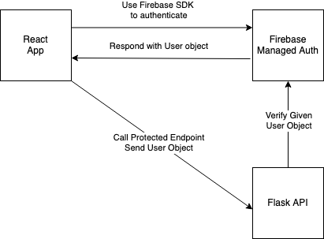

<!-- @import "[TOC]" {cmd="toc" depthFrom=1 depthTo=6 orderedList=false} -->

<!-- code_chunk_output -->

- [Client](#client)
  - [Deployment](#deployment)
  - [Rewrites](#rewrites)
- [API](#api)
  - [Deployment](#deployment-1)
- [Auth](#auth)

<!-- /code_chunk_output -->

# Client

The client is a React SPA. For deployment the Client is pushed to [Firebase Hosting](https://firebase.google.com/docs/hosting). This is a managed hosting solution that handles serving static content with a CDN.

## Deployment

From the root directory run the following command

```
firebase deploy
```

This should build the React app and deploy the output to firebase.

## Rewrites

Rewrites allow the the web app on Firebase Hosting to seamlessly communicate with resources in Cloud Functions and Cloud Run. Learn more about them [here](https://firebase.google.com/docs/hosting/full-config#rewrites). Using the rewrites allows us to call a path, like `/api/subscribe` rather than having to directly call a full URL like `https://subscribe-service.com/api/subscribe`. This is because Google Cloud will handle the routing to this full URL based on the rewrites config.

# API

The API is a Python Flask app. For deployment the code is built into a container (using the Docker format) and the image is pushed to [Artifact Registry](https://cloud.google.com/artifact-registry). Then you can create a [Cloud Run](https://cloud.google.com/run?hl=en) service based off the container image. This is a fully managed serverless solution. We do not have to worry about specific server requirements. Cloud Run will automatically scale and manage our application for us.

## Deployment

From the `src` directory, run the following commands

```
gcloud builds submit --tag gcr.io/lukiman-twitter-subs/subscriber-api
gcloud run deploy --image gcr.io/lukiman-twitter-subs/subscriber-api
```

The above commands will build and push the docker image and then deploy a service from the docker image.

# Auth

The authentication is handled through [Firebase Authentication](https://firebase.google.com/docs/auth) this simplifies our code because we do not have to manually manage users or identity providers. From there we can use the Firebase SDKs to authenticate users on the client side and verify that authentication on the server (API) side.


