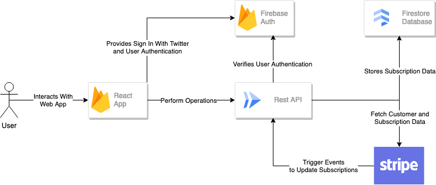
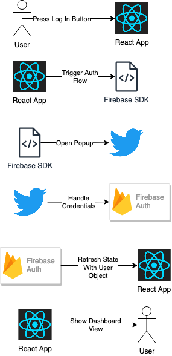
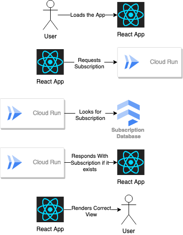

<!-- @import "[TOC]" {cmd="toc" depthFrom=1 depthTo=6 orderedList=false} -->

<!-- code_chunk_output -->

- [Overview](#overview)
- [Front-End](#front-end)
  - [Login View](#login-view)
  - [Dashboard View](#dashboard-view)
  - [Deployment](#deployment)
    - [Rewrites](#rewrites)
- [Back-end](#back-end)
  - [/api/getCheckoutLink](#apigetcheckoutlink)
  - [/api/getMySubscription](#apigetmysubscription)
  - [/webhook/stripe](#webhookstripe)
  - [Deployment](#deployment-1)
- [Environment Variables](#environment-variables)

<!-- /code_chunk_output -->

# Overview

The code in this repository is a fully functioning Stripe subscription management solution. It is comprised of two key parts. The first part, is a web application exposed on the internet for users to interact with. This portion is responsible for displaying subscription status in a human readable format and directing users to the Stripe checkout or management pages. The second part is a REST API. This REST API is also exposed on the internet to allow for programmatic access via HTTP requests. This is what allows the web application to interface with Stripe and other confidential operations while ensuring we only expose safe and required data to users. See the diagram below for a full overview of the application deployment.


# Front-End

The front-end web application is created using [React](https://react.dev/). This is a [SPA](https://developer.mozilla.org/en-US/docs/Glossary/SPA) framework meaning the entire website is loaded at once. From there, the website acts like an application. It uses JavaScript (or TypeScript converted to JavaScript in this case) to decide what should happen on the web page. When a user visits the website, the react app is loaded by the `index.html` file. From here the entrypoint is the `App.tsx` file. In this file, we utilize the [Firebase Auth SDK](https://firebase.google.com/docs/auth) to check if this user has logged in. If they haven't, we display the Login View. If they have, we display the Dashboard View.

## Login View

The [Login View](./client/src/views/Login.tsx) is a simple page that mainly focuses on the "Sign In With Twitter" button. Upon clicking this button, a Firebase Auth SDK function is used to open the "Sign In With Twitter" popup. From there, [Firebase Auth](https://firebase.google.com/docs/auth) handles the rest. Depending on the user's actions, the [React State](https://react.dev/learn/state-a-components-memory) for the upper-level `App.tsx` file will change. This causes the page to be revaluated. Upon this reevaluation the JavaScript will determine a user object is present and load the Dashboard View. This process looks like the diagram below. Note that each arrow is not necessarily indicative of a singular action or web request. Instead it may represent a general process or chain of events.


## Dashboard View

The [Dashboard View](/client/src/views/Dashboard.tsx) is a page with two possible states, both require the user to be logged in. Either the user has a subscription or it does not. This state is acquired from the API. The React App makes a HTTP request to the API endpoint and the API endpoint will respond with a status indicating no subscription was found or an object of the subscription and the url to manage it. Based on that return the Dashboard View will display the proper button and information pertaining to the subscription object if there is any. This process looks like the diagram below.


## Deployment

The React App is hosted on [Firebase Hosting](https://firebase.google.com/docs/hosting). Firebase Hosting is a fully managed platform on Google Cloud to host and serve content on the web. The firebase application can be deployed using the following command in the root directory, assuming you have the firebase CLI tools installed and initialized properly.
`firebase deploy`

### Rewrites

A key functionality of firebase hosting is [rewrites](https://firebase.google.com/docs/hosting/full-config#rewrites). Rewrites allow you to route specific requests to ensure your app functions properly. Our app requires two rewrites. The first is for `/api/**`. This rewrite will redirect any API requests to our back-end REST API service. This is beneficial because it acts like a built in proxy. Instead of using the full back-end deployment url and enabling CORS we can request to the same server hosting our web app and it will handle it properly. The second rewrite is `**` to `index.html` this is what allows our React SPA to do it's thing. In the future, there may be one than more page or URL accessible on our React App. This rewrite allows the app to handle page serving in the browser by it self. In contrast a normal web app relies on a server to provide the correct webpage at a certain path.

# Back-end

The back-end application is created using Python and [Flask](https://flask.palletsprojects.com/en/3.0.x/). This code exposes 3 HTTP endpoints that allow the app to function. The first two are accessible to users from the web app and the third is accessible to Stripe so that subscription status can be kept up to date.

## /api/getCheckoutLink

This route is intended for users who do not have a valid subscription. It will integrate with Stripe via the [Stripe SDK](https://stripe.com/docs/development/quickstart?lang=python) for Python. When a user requests the endpoint, it will verify they are logged in. From there it can create a personalized checkout link for the given project and pre-fill the user's email.

## /api/getMySubscription

This route is intended for users who do have a valid subscription regardless of status. It integrates with Firebase and Stripe to retrieve the user's subscription data and create a subscription management portal link. When a user requests the endpoint, it verifies that they are logged in. From there it searches the database for a record matching their email. Afterwards, it uses the `customer_id` from the database in a call to Stripe to create a customer portal url. Finally it returns both of these items for the web app to handle accordingly. In the event that a user record does not exist in the database (they have no subscription at all) it returns status code 404.

## /webhook/stripe

This route is intended to be used only by Stripe. It is an endpoint to handle [Stripe webhook requests](https://stripe.com/docs/webhooks). This is what keeps our Firestore Database up to date with user subscription status details.
It verifies a signature within the request that ensures the request was sent from Stripe. This prevents malicious actors from forging events (like payment succeeded) to this endpoint. Furthermore, it is only subscribed for a few events from Stripe that are necessary for our purposes.

## Deployment

The back-end API is hosted on [Cloud Run](https://cloud.google.com/run?hl=en). Cloud Run is a fully managed solution that allows you to build and run code in a containerized environment using [Docker](https://www.docker.com/) format. After it is deployed, Google Cloud will handle the scaling and provisioning of resources to meet the demand of requests. The application can be built and deployed with the two following commands, assuming your development environment is set up properly.

```
gcloud builds submit --tag gcr.io/lukiman-twitter-subs/subscriber-api
gcloud run deploy --image gcr.io/lukiman-twitter-subs/subscriber-api
```

# Environment Variables

Environment variables allow you to configure the application at run time. The back-end requires a few environment variables to function.

- `STRIPE_API_KEY`: This key is necessary to use the Stripe APIs
- `SUBSCRIPTION_PRICE_ID`: This is the ID of the Stripe Price associated with the subscription. It is required to create the checkout link for the subscription.
- `STRIPE_WEBHOOK_SECRET`: This is the webhook signing secret. It is required to verify that webhook events are coming from Stripe
- `FRONTEND_URL`: This is the URL of the Firebase Hosting React App. This is used to set up redirects on the pages hosted by Stripe.

Environment variables for Cloud Run can be set through the Google Cloud Console. Find guidance [here](https://cloud.google.com/run/docs/configuring/services/environment-variables).
